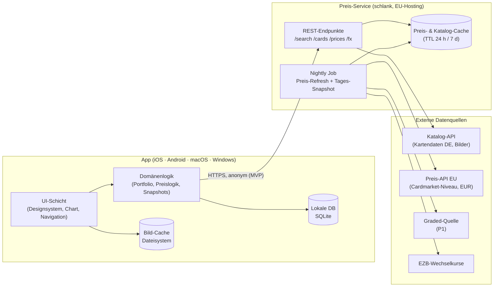
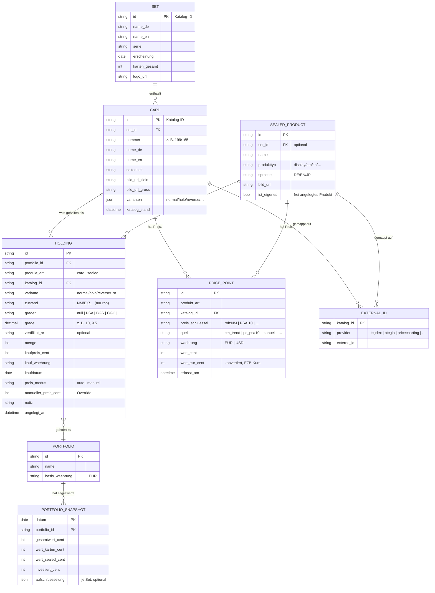
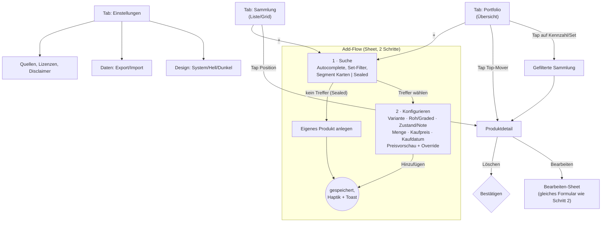

# MyCollector — Konzept- & Architekturdokument

> **Version:** 1.0 · **Stand:** 16. August 2026
> **Status:** Planungsphase — dieses Dokument enthält bewusst keinen Code und keine Implementierung.
> **Zweck:** Grundlage für die Entwicklung einer App zur Verwaltung einer Pokémon-Sammlung (Einzelkarten & versiegelte Produkte) mit Portfolio-Wertentwicklung im Börsen-Stil, für Sammler im deutschsprachigen Raum.

---

## 0. Das Wichtigste in Kürze

_[Wird nach Abschluss der API-Recherche finalisiert — Zusammenfassung der Kernentscheidungen.]_

---

## 1. Produktvision & Leitplanken

### 1.1 Vision

MyCollector behandelt eine Pokémon-Sammlung wie ein Wertpapier-Depot: Jede Karte und jedes versiegelte Produkt ist eine „Position" mit Einstandspreis, aktuellem Marktwert und Wertentwicklung. Die App beantwortet auf einen Blick die Fragen: **Was ist meine Sammlung heute wert? Wie hat sie sich entwickelt? Was sind meine besten und schlechtesten Positionen?**

### 1.2 Zielgruppe

- Sammler im deutschsprachigen Raum (DE/AT/CH), die deutsche und englische Karten sammeln.
- Referenzmarkt ist der **europäische Markt** (Cardmarket-Preisniveau, EUR) — nicht der US-Markt, dessen Preise für DACH-Sammler oft unrealistisch sind.
- Sowohl „Binder-Sammler" (Einzelkarten, teils gegradet) als auch „Sealed-Investoren" (Booster Boxes, Elite Trainer Boxes etc.).

### 1.3 Leitplanken (Design- und Architekturprinzipien)

| # | Prinzip | Konsequenz |
|---|---------|------------|
| L1 | **EU-Preise zuerst** | Preisreferenz primär Cardmarket-basiert in EUR; US-Quellen (USD) nur als Fallback, klar gekennzeichnet und umgerechnet. |
| L2 | **Local-first** | Die Sammlung gehört dem Nutzer und liegt lokal auf dem Gerät. Die App funktioniert offline (bis auf Suche/Preisabruf). Cloud-Sync ist eine spätere Option, keine Voraussetzung. |
| L3 | **Ehrliche Preise** | Jeder angezeigte Preis trägt Quelle und Zeitstempel („Cardmarket-Trend, Stand 15.08."). Kein Preis wird als exakter Wert verkauft — es sind Referenzwerte. Manuelle Overrides sind ein gleichberechtigtes Erstklass-Feature, kein Notbehelf. |
| L4 | **Apple-like, aber eigenständig** | UI orientiert sich an den Human Interface Guidelines (Weißraum, Typografie, Blur, sanfte Animationen), wird aber als eigenes Designsystem umgesetzt, das auf allen Plattformen identisch funktioniert. |
| L5 | **Austauschbare Datenquellen** | Jede externe API sitzt hinter einer eigenen Abstraktionsschicht (Provider-Interface). Kein API-Anbieter darf so tief verdrahtet sein, dass ein Wechsel eine Neuentwicklung bedeutet — die Erfahrung zeigt, dass TCG-APIs kommen, gehen und ihre Konditionen ändern. |
| L6 | **Ein Code für alle Plattformen** | iOS zuerst, Android und Desktop (macOS/Windows) aus derselben Codebasis, mit plattformspezifischen Anpassungen nur an der Oberfläche (Navigation, Eingabemethoden). |

---

## 2. Feature-Übersicht & Priorisierung

Priorisierung in drei Stufen: **P0 = MVP** (ohne das Feature ist die App nicht sinnvoll nutzbar), **P1 = erste Ausbaustufe** (direkt nach dem MVP), **P2 = später** (wertvoll, aber verzichtbar).

### 2.1 P0 — MVP

| Feature | Beschreibung | Anmerkungen |
|---------|--------------|-------------|
| **Kartensuche mit Autocomplete** | Suche nach Kartennamen (deutsch & englisch) mit Sofortvorschlägen, Filter nach Set; Trefferliste mit Kartenbildern. | Kartenbilder werden automatisch aus der Katalog-API geladen (→ §3). |
| **Position hinzufügen: Karten** | Karte auswählen → Variante (Normal/Holo/Reverse Holo), Zustand (NM–PO) bei Rohkarten, **Umschalter Rohkarte ↔ Gegradet** (PSA/BGS/CGC + Note, optional Zertifikatsnummer), Menge, Kaufpreis, Kaufdatum, Notiz. | Grading ändert die Preisreferenz (→ §4.5 Preislogik). |
| **Position hinzufügen: Sealed** | Versiegelte Produkte (Display/Booster Box, ETB, Tin, Collection Box …) aus Katalog wählen oder als **freies Produkt** anlegen (Name, Foto optional, manueller Preis). | Sealed-Kataloge/-Preise sind API-seitig dünner als Karten — das freie Produkt garantiert, dass nichts „nicht erfassbar" ist. |
| **Manueller Preis-Override** | Pro Position kann der automatische Preis durch einen eigenen Wert ersetzt werden (z. B. eigener eBay-Verkaufspreis als Referenz). Override ist sichtbar markiert und jederzeit rücknehmbar. | Kernanforderung; besonders wichtig für gegradete Karten und Sealed. |
| **Automatischer Preisabruf (Rohkarten)** | Täglicher Abruf der EU-Marktpreise für alle Portfolio-Karten + manueller Refresh (Pull-to-Refresh). | Quelle → §3; Aktualisierungsstrategie → §4.5. |
| **Portfolio-Übersicht mit Chart** | Interaktiver Wertverlaufs-Chart (Börsen-Stil) mit Zeiträumen 1W/1M/3M/1J/Max, Scrubbing per Touch, Tagesveränderung (€/%), Gesamtrendite vs. Einstand. | Kurve entsteht aus täglichen Snapshots ab Nutzungsbeginn (→ §4.5 „Backfill-Problem"). |
| **Kennzahlen & Aufschlüsselung** | Top-Gewinner/-Verlierer (Tag & Gesamt), Aufteilung Karten vs. Sealed sowie nach Sets (Donut/Balken). | |
| **Sammlungsverwaltung** | Liste/Grid aller Positionen mit Suche, Filter (Kategorie, Set, Roh/Graded), Sortierung (Wert, Performance, Name, Kaufdatum), Bearbeiten & Löschen (Swipe-Aktionen). | |
| **Dark Mode / Light Mode** | Umschaltbar Hell/Dunkel/System, Default: Systemerkennung. | |
| **Datenexport/-import (lokal)** | Vollständiger Export als JSON (Backup) — Pflicht bei Local-first, sonst droht Datenverlust bei Gerätewechsel. | CSV-Export der Positionen zusätzlich (für Excel). |
| **Deutsch als UI-Sprache** | UI komplett deutsch; Architektur i18n-fähig (Englisch als P1). | |

**Bewusst NICHT im MVP:** Accounts/Cloud-Sync, Karten-Scanner, Preisalarme, Verkaufs-Tracking, Android-/Desktop-Release (Codebasis ist vorbereitet, Release-Reihenfolge → §8).

### 2.2 P1 — Erste Ausbaustufe

| Feature | Beschreibung |
|---------|--------------|
| **Graded-Preisautomatik** | Automatische Preisreferenz für PSA/BGS/CGC-Karten aus einer Graded-Preisquelle inkl. eBay-Verkaufspreis-Fallback (→ §3.4). Bis dahin: manueller Override + letzter bekannter Wert. |
| **Sealed-Preisautomatik** | Automatische EU-Preise für gängige Sealed-Produkte (quellenabhängig, → §3). |
| **Android-Release** | Gleiche Codebasis, Anpassung an Material-Erwartungen nur wo nötig (Back-Geste, Ripple). |
| **Desktop-Release (macOS/Windows)** | Sidebar-Layout, Master-Detail, Tastaturkürzel (→ §5.5). |
| **Cloud-Sync & Accounts (optional aktivierbar)** | Ende-zu-Ende der Local-first-Daten über einen EU-gehosteten Backend-Dienst; Gerätewechsel & Mobile↔Desktop-Sync. |
| **Watchlist** | Karten/Produkte beobachten, ohne sie zu besitzen. |
| **Preisalarme** | Push bei Über-/Unterschreiten von Schwellwerten. |
| **CSV-Import** | Bestandsimport aus Tabellen (Spalten-Mapping-Assistent). |
| **Mehrere Portfolios/Ordner** | z. B. „Sammlung", „Invest", „Verkaufsstapel". |

### 2.3 P2 — Später

| Feature | Beschreibung |
|---------|--------------|
| **Karten-Scanner** | Karte per Kamera erkennen (ML-Erkennung, z. B. Ximilar-API oder eigenes Modell) → Add-Flow vorausgefüllt. |
| **Verkaufs-Tracking** | Positionen als „verkauft" abschließen (Verkaufspreis/-datum, Gebühren) → realisierte Gewinne, Steuer-Report (Haltefrist §23 EStG als Info). |
| **Set-Vervollständigung** | Fortschritt „x/y Karten des Sets" mit Lückenliste. |
| **Home-Screen-Widgets** | Portfolio-Wert & Tagesveränderung als iOS/Android-Widget. |
| **Grading-ROI-Rechner** | „Lohnt sich Grading?" — Rohpreis vs. Graded-Preis minus Grading-Kosten. |
| **Sharing** | Portfolio-/Positions-Karten als Bild exportieren (ohne Wertangaben optional). |
| **Historien-Backfill** | Rückwirkende Wertkurve ab Kaufdatum, sofern die Preisquelle Historie liefert (→ §4.5). |
| **Mehrwährung** | Anzeige in CHF für CH-Nutzer, EZB-Kurse. |

---

## 3. Datenquellen: API-Vergleich & Empfehlung

_[Dieser Abschnitt wird nach Abschluss der Live-Recherche (Stand August 2026) befüllt: Vergleich TCGdex, Pokémon TCG API (pokemontcg.io), Scrydex, Cardmarket-API, CardTrader, JustTCG, PriceCharting, eBay-APIs u. a. — inkl. Preismodellen, Rate Limits, Lizenzbedingungen, Sprachunterstützung, Bildern und Graded-Tauglichkeit, jeweils mit Quellenangabe.]_

---

## 4. Technische Architektur

### 4.1 Plattformstrategie: Framework-Wahl für Mobile + Desktop

**Anforderungsprofil:** iOS zuerst mit Apple-like *eigenem* Design (nicht native Standard-Controls), interaktiver Finanz-Chart mit Scrubbing + Haptik, Android, **plus** Desktop macOS *und* Windows — mit maximal gemeinsamem Code; Offline-SQLite; mittlere App-Komplexität.

**Vergleich (Stand August 2026, Quellen → Anhang A):**

| Kriterium | **Flutter** | React Native + Expo | Kotlin/Compose Multiplatform | Tauri v2 | Skip |
|---|---|---|---|---|---|
| iOS-Designtreue (Custom-HIG-Look) | ◕ sehr gut (eigener Renderer, Blur/120 fps) | ● sehr gut (echte native Primitive) | ◑ Material-first, HIG selbst bauen | ○ WebView-Look | ● perfekt (echtes SwiftUI) |
| Android | ● | ◕ | ● | ◑ | ◑ jung |
| Desktop macOS | ◕ stabil seit 2022 | ○ Fork hinkt 4 Versionen hinterher | ◕ reif | ● exzellent | ○ separat zu pflegen |
| Desktop Windows | ◕ stabil | ◑ MS-Fork, näher an Core | ◕ reif | ● exzellent | ✗ keins |
| Interaktive Charts (Scrubbing/Haptik) | ● fl_chart / eigener Painter, gelöst | ● beste Fertigbibliotheken (Victory Native, wagmi-charts) | ◑ Ökosystem-Lücke, selbst bauen | ◑ Web-Charts | ◑ unklar |
| Offline-DB | ◕ **Drift** (SQLite) | ◕ expo-sqlite/OP-SQLite | ● SQLDelight/Room-KMP | ◕ SQLite-Plugin | ◑ |
| Code-Teilung über alle 4 Ziele | ● eine Codebasis, ein Renderer | ◑ Desktop = zweiter Pfad | ◕ | ◕ | ○ |
| Ökosystem/Community | ◕ sehr groß | ● am größten (JS/TS) | ◑ kleiner | ◑ | ○ Ein-Anbieter-Risiko |

*(● = stark · ◕ = gut · ◑ = mit Einschränkungen · ○ = schwach · ✗ = nicht vorhanden)*

**Empfehlung: Flutter.** Begründung entlang der Anforderungen:

1. **Vier Zielplattformen, eine Codebasis, ein Renderer.** Flutter (stabil: 3.44, Mai 2026) ist 2026 die einzige Option, bei der iOS, Android, macOS **und** Windows aus derselben Codebasis mit First-Party-Tooling stabil bedient werden. Genau das verlangt die Desktop-Anforderung. React Native ist auf iOS/Android mindestens ebenbürtig, aber der Desktop-Pfad ist ehrlich betrachtet ein zweiter Codepfad: `react-native-macos` hängt der Core-Version ~4 Minor-Releases hinterher, Expo unterstützt Desktop nicht, und der praktikable Ausweg (react-native-web in Electron/Tauri verpackt) verwässert das Ziel „möglichst viel gemeinsamer Code".
2. **Das gewünschte Design ist ein *eigenes* Apple-like Designsystem** (L4) — nicht das Nachahmen nativer Standard-Controls. Flutters „Owned-Canvas"-Rendering (alles wird selbst gezeichnet: Blur, Radien, 120-fps-Animationen auf ProMotion) ist exakt dafür die Stärke. Damit relativiert sich Flutters bekannte Schwäche, dass die mitgelieferten Cupertino-Widgets Apples neue „Liquid Glass"-Designsprache (iOS 26) erst mit dem für Ende 2026 angekündigten Umbau nachziehen: Wir bauen ohnehin eigene Komponenten; wo echte native Optik punktuell gewünscht ist, existieren Brücken-Pakete mit nativen Views.
3. **Der Chart ist machbar und bewährt.** Finanz-Charts mit Touch-Scrubbing und Haptik sind in Flutter ein gelöstes Problem (fl_chart bzw. eigener CustomPainter mit `HapticFeedback`) — hier hat React Native mit spezialisierten Bibliotheken (wagmi-charts, aus Krypto-Portfolio-Apps entstanden) zwar das beste Fertigangebot, der Vorsprung rechtfertigt aber nicht den Desktop-Nachteil.
4. **Lokale Datenbank: Drift** (typsicheres SQLite mit reaktiven Queries, alle Plattformen inkl. Desktop). Wichtiger Recherchebefund: **Isar und Hive sind faktisch verwaist** — Drift ist 2026 die wartungssichere Wahl.

**Bewusst in Kauf genommene Nachteile von Flutter:** Dart statt TypeScript (kleinerer Talentpool als JS, aber schnell erlernbar); kein „gratis" natives iOS-Verhalten — Details wie Navigations-Swipe-Physik müssen bewusst nachgebaut/geprüft werden; Cupertino-/Liquid-Glass-Rückstand wie oben beschrieben (durch eigenes Designsystem neutralisiert).

**Zweitplatzierter für ein anderes Szenario:** Wäre Desktop verhandelbar (nur iOS+Android), fiele die Wahl auf **React Native + Expo** (RN 0.85 / Expo SDK 56, New Architecture seit SDK 55 Standard; Coinbase als Beleg für Finanz-UX in Produktionsqualität). Kotlin/Compose Multiplatform (iOS stabil seit Mai 2025, heute 1.11.x) ist produktionsreif, aber Material-zentriert und im Chart-Ökosystem am dünnsten. Tauri v2 bleibt eine exzellente Desktop-Shell, ist aber als Primär-Framework einer iOS-first-App mit 120-fps-Anspruch (WebView-UI) ungeeignet. Skip (SwiftUI→Android) liefert perfekte iOS-Treue, scheitert aber an fehlendem Windows-Support und Ein-Anbieter-Risiko.

**Empfohlener Stack (Flutter):**

| Baustein | Wahl | Anmerkung |
|----------|------|-----------|
| Sprache/Framework | Dart 3.12 / Flutter ≥ 3.44 | iOS, Android, macOS, Windows aus einer Codebasis |
| Lokale DB | **Drift** (SQLite) | reaktive Streams treiben die UI; Migrationen versioniert |
| State Management | Riverpod | testbar, kompiliersicher; Alternative: Bloc (Geschmacksfrage) |
| Chart | fl_chart als Basis, bei Bedarf eigener CustomPainter | Scrubbing/Haptik/Morphing → §5.4 |
| HTTP | dio (+ Retry-Interceptor) | Backoff/Circuit-Breaker → §4.5 |
| Navigation | go_router | Deep-Links (P1: Alarme → Detail) |
| Bilder | cached_network_image + Disk-Cache | → §4.5 Caching |
| i18n | intl / ARB | Deutsch zuerst, Englisch vorbereitet |

### 4.2 Systemarchitektur im Überblick

Die Architektur folgt dem Prinzip **„fetter Client, dünner Server"**: Die gesamte Sammlungs- und Portfoliologik lebt im Client (local-first, SQLite). Ein bewusst schlanker Backend-Dienst („Preis-Service") existiert aus genau vier Gründen:

1. **API-Schlüssel schützen.** Schlüssel kostenpflichtiger oder kontingentierter APIs dürfen niemals in die App eingebettet werden (aus jedem App-Binary extrahierbar). Alle Preis-/Katalogabrufe mit Schlüssel laufen über den Proxy.
2. **Caching & Kontingent-Schutz.** 1 000 Nutzer, die dieselbe Glurak-Karte halten, dürfen nicht 1 000 API-Calls auslösen. Der Server cached pro Karte/Tag und hält damit Rate Limits und Kosten unter Kontrolle.
3. **Tägliche Snapshots.** Die Wertkurve braucht einen verlässlichen Tagesabschluss — auch wenn die App tagelang nicht geöffnet wird (→ §4.5).
4. **Zukunftspfad Sync/Alarme.** Accounts, Geräte-Sync und Preisalarme (P1) brauchen ohnehin einen Server; der Preis-Service ist deren Keimzelle.

**Abgrenzung:** Im MVP ist der Preis-Service **zustandslos gegenüber Nutzern** — er kennt keine Accounts, sondern beantwortet nur Katalog-/Preisfragen und cached sie. Die Snapshot-Berechnung läuft im MVP **clientseitig** beim ersten App-Start des Tages (plus Nachholen verpasster Tage aus dem Server-Preisarchiv); erst mit Cloud-Sync (P1) wandern Snapshots serverseitig. Damit bleibt der MVP-Betrieb datenschutzarm und günstig.

### 4.3 Backend-Empfehlung

Anforderungen: HTTP-Proxy mit Cache, Cron-Jobs, kleine Datenbank fürs Preisarchiv, EU-Region, minimale Betriebskosten, späterer Ausbau zu Auth + Sync.

| Option | Stärken | Schwächen | Bewertung |
|--------|---------|-----------|-----------|
| **Supabase** (Postgres + Edge Functions + Cron + Auth, Region Frankfurt) | Preisarchiv, Cron und späteres Auth/Sync in einem Produkt; generöser Free Tier; DSGVO-freundlich (EU-Region, AVV) | Edge Functions kaltstartabhängig; Vendor-Bindung moderat (Kern ist Postgres → migrierbar) | **Empfehlung** — deckt MVP und P1-Sync ohne Technologiewechsel ab |
| **Cloudflare Workers + D1/KV** | Extrem günstig, global schnell, ideal als reiner Cache-Proxy | Auth/Sync später = Zusatzbausteine; D1 jünger als Postgres; EU-Datenlokalität konfigurationsbedürftig | Gute Alternative, wenn Sync dauerhaft ausgeschlossen wird |
| **Eigener kleiner Server (z. B. Container bei Hetzner)** | Volle Kontrolle, EU, fixe Kosten | Betrieb/Wartung/Monitoring selbst; für Ein-Personen-Projekt unnötige Last | Nur bei starkem Selbsthosting-Wunsch |
| **Gar kein Backend (Stufe 0)** | Null Betriebskosten | Nur mit komplett freien, schlüssellosen APIs möglich; Keys kostenpflichtiger APIs im Client wären kompromittiert; kein Snapshot-Nachholen, keine Alarme, kein Sync-Pfad | Akzeptabel für einen rein privaten Prototyp; nicht empfohlen ab erster Veröffentlichung |

**Empfehlung: Supabase (EU/Frankfurt).** Der MVP nutzt davon nur Edge Functions (Proxy) + Postgres (Preisarchiv, Katalog-Cache) + Scheduled Jobs (Nightly Refresh). Auth, Storage und Realtime bleiben ungenutzt liegen, bis Sync (P1) kommt — dann sind sie ohne Migration verfügbar.

### 4.4 Datenmodell

Das Modell trennt strikt **Katalog** (was existiert — kommt aus APIs, wird gecacht), **Bestand** (was besitze ich — Nutzerdaten, heilig), **Preise** (was ist es wert — Zeitreihen je Quelle) und **Portfolio-Historie** (was war meine Sammlung wert — abgeleitete Snapshots).

**Zentrale Modellentscheidungen:**

1. **Lot-Prinzip statt Stückzahl-Aggregat.** Jeder Kauf ist eine eigene `HOLDING` (ein „Lot") mit eigenem Kaufpreis/-datum. Zweimal dieselbe Karte gekauft = zwei Positionen (in der UI aggregierbar). Nur so sind Einstandsrendite, spätere Teilverkäufe und Haltefristen sauber abbildbar.
2. **Grading ist ein Attribut der Position, nicht der Karte.** Katalogkarte bleibt eine; `grader`+`grade` an der Holding bestimmen, welcher `preis_schluessel` für die Bewertung gezogen wird (`roh:NM` vs. `PSA:10`). Der Umschalter Roh↔Graded im UI ändert genau diese Felder.
3. **Preise sind Zeitreihen mit Quelle, nie ein einzelnes Feld.** `PRICE_POINT` speichert jeden Abruf (append-only) mit Quelle, Originalwährung und EUR-Umrechnung. Daraus entstehen: aktueller Preis (jüngster Punkt), „Stand"-Badge, Positions-Mini-Chart und das Backfill-Potenzial. Manuelle Overrides werden ebenfalls als Punkt (`quelle = manuell`) historisiert.
4. **Snapshots sind append-only Tagesabschlüsse.** Ein `PORTFOLIO_SNAPSHOT` pro Tag (Zeitzone Europe/Berlin). Nachträgliche Käufe/Löschungen verändern vergangene Snapshots **nicht** — die Kurve verhält sich wie ein Depot bei Ein-/Auszahlung (Sprung am Kauftag). Zusätzlich wird `investiert_cent` je Tag festgehalten, sodass der Chart optional eine zweite „Einstand"-Linie zeigen kann und Rendite ehrlich als Wert vs. investiertes Kapital ausweisbar ist. (Alternative „rückwirkende Neuberechnung ab Kaufdatum" → §7, offene Frage.)
5. **ID-Mapping als eigene Tabelle.** Kein API-Anbieter ist führend für Identität. `EXTERNAL_ID` mappt die interne Katalog-ID auf Provider-IDs; fachlicher Schlüssel fürs Matching ist `(Set-Code, Kartennummer)`. Damit bleibt L5 (Austauschbarkeit) real.

### 4.5 API-Integrationsstrategie

**Preislogik — die effektive Bewertung einer Position** folgt einer festen Fallback-Kaskade (erste zutreffende Stufe gewinnt; die UI zeigt immer, welche Stufe aktiv ist):

1. **Manueller Override** (`preis_modus = manuell`) — vom Nutzer gesetzt, mit Datum.
2. **Graded-Preis** der passenden Quelle für `grader+grade` (P1; USD-Quellen → EZB-Umrechnung, gekennzeichnet).
3. **Roh-Marktpreis EU** (Cardmarket-Niveau) für Karte+Variante.
4. **Letzter bekannter Preis** aus `PRICE_POINT` — mit deutlichem „Stand: <Datum>"-Badge, wenn älter als 48 h.
5. **Kaufpreis** als Notwert — grau markiert als „kein Marktpreis verfügbar".

Für gegradete Karten ohne automatische Quelle (MVP) greift Stufe 1 bzw. 4/5 — plus der angeforderte **eBay-Verkaufspreis als Fallback-Anzeige** (→ §3.4): zuletzt bekannter Verkaufspreis wird als Referenz im Detail-Screen angezeigt und kann per Tap als Override übernommen werden.

**Caching-Ebenen:**

| Ebene | Inhalt | Gültigkeit | Zweck |
|-------|--------|------------|-------|
| Server-Cache (Postgres) | Preis je (Karte, Variante, Preis-Schlüssel) | 24 h (Preis), 7 Tage (Katalog-Metadaten) | Upstream-Rate-Limits & Kosten entkoppeln von Nutzerzahl |
| Client-DB (SQLite) | Alle Preise/Kataloge der eigenen Positionen | unbegrenzt (append-only) | Offline-Fähigkeit, Historie |
| Client-Bildcache | Kartenbilder | LRU, ~200 MB | Bilder nur 1× laden; Offline-Anzeige |

**Aktualisierungsrhythmus:**

- **Nightly (Server, ~05:30 Europe/Berlin):** Refresh **nur** der Karten/Produkte, die in mindestens einem Portfolio vorkommen (demand-driven, per Batch-Abfragen), danach Ablage im Preisarchiv. Kein Vollabzug ganzer Kataloge.
- **App-Start:** Wenn letzte Synchronisation > 6 h: Preise der eigenen Positionen vom Server ziehen (ein Batch-Call), fehlende Tages-Snapshots seit letzter Nutzung aus dem Server-Preisarchiv nachberechnen.
- **Pull-to-Refresh:** Erzwingt Server-Abfrage; der Server holt upstream nur nach, wenn sein Cache > 15 min alt ist (Cooldown gegen Missbrauch/Kosten).
- **Einzelabruf:** Beim Öffnen eines Produktdetails, falls Preis > 24 h alt.

**Beispielrechnung Kontingent (Größenordnung):** Portfolio mit 500 Karten → 500 Preispunkte/Tag; bei Batch-Abfragen (z. B. 50 Karten/Request) ≈ 10 Upstream-Requests/Tag/Nutzer, durch Server-Cache über Nutzer hinweg dedupliziert. Selbst konservative Free-Tier-Limits tragen damit hunderte Nutzer; die konkrete Budgetplanung folgt aus den Limits der gewählten APIs (→ §3).

**Fehlerbehandlung:** Retries mit exponentiellem Backoff (2 s/4 s/8 s), Circuit Breaker pro Provider (bei Ausfall: Provider 30 min meiden, Kaskade greift), keine Fehler-Popups für Hintergrund-Refreshes — stattdessen stiller Fallback auf letzte bekannte Preise mit „Stand"-Badge.

**Das Backfill-Problem (wichtig für die Erwartungshaltung):** Ein Börsen-Chart lebt von Historie — aber die Portfolio-Kurve kann erst ab dem Tag wachsen, an dem die App die Sammlung kennt. Es gibt keine allgemein verfügbare, lückenlose EU-Preishistorie je Karte zum Nachladen. Konsequenzen: (a) Der Chart kommuniziert das ehrlich („Deine Wertkurve entsteht ab jetzt — täglich ein Punkt"), (b) das Datenmodell (append-only `PRICE_POINT`) ist so gebaut, dass rückwirkende Kurven ab Kaufdatum nachgerüstet werden können, falls eine Quelle mit Preishistorie verfügbar ist/wird (P2, → §3), (c) je früher der Nightly-Snapshot läuft, desto wertvoller wird die App — ein Argument für den frühen Backend-Aufbau.

**Wechselkurse:** Täglicher EZB-Referenzkurs (USD→EUR) über eine freie FX-API, serverseitig gecacht; `PRICE_POINT` speichert Originalwährung **und** EUR-Wert zum Abrufzeitpunkt (keine rückwirkende Neubewertung durch Kursschwankung).

### 4.6 Lokale Persistenz, Backup & Sync-Pfad

- **SQLite** als einzige Wahrheit im Client; Schema-Migrationen versioniert ab Tag 1.
- **Backup:** manueller JSON-Vollexport (Teilen-Sheet/Datei) + Hinweis in den Einstellungen; auf iOS zusätzlich automatisch via iCloud-Geräte-Backup abgedeckt.
- **Sync (P1):** Local-first bleibt; Synchronisation als Abgleich pro Entität mit `updated_at`-Konfliktlösung (last-write-wins pro Feldgruppe reicht für Ein-Personen-Daten; kein CRDT-Overkill). Server = Supabase Auth + Postgres. Sync ist **opt-in**; ohne Account bleibt alles lokal.

---

## 5. UI/UX-Konzept

### 5.1 Designsprache

Orientierung an Apples Human Interface Guidelines, umgesetzt als eigenes, plattformübergreifend identisches Designsystem:

- **Typografie:** Systemschrift (SF Pro auf Apple, Roboto/Inter auf Android/Windows); große, ruhige Titel (Large Title beim Scrollen einklappend), Zahlen im Portfolio mit Tabellenziffern (kein „Zappeln" beim Ticken).
- **Farben & Materialien:** viel Weißraum, neutrale Flächen; Akzentfarbe sparsam; Gewinn/Verlust in Grün/Rot **plus** Vorzeichen (±) für Farbfehlsichtigkeit; Blur-/Material-Effekte für Bars und Sheets; Karten-Motive mit dezentem Schatten und 12–16 pt Eckenradius.
- **Dark/Light:** Semantische Farb-Tokens (nie Roh-Hexwerte in Views); Modus Hell/Dunkel/System in den Einstellungen, Default System. Charts und Kartenbilder werden in beiden Modi geprüft (dunkle Holo-Karten auf dunklem Grund brauchen dezente Aufheller-Fläche).
- **Motion:** sanfte, kurze Übergänge (200–350 ms, Ease-out); Hero-Übergang Kartenbild → Detail; Chart-Morphing beim Zeitraumwechsel; Respektierung von „Bewegung reduzieren".
- **Haptik (iOS/Android):** feine Ticks beim Chart-Scrubbing, Erfolgs-Haptik beim Hinzufügen.

### 5.2 Navigationsstruktur (Mobile)

Drei Tabs — bewusst flach gehalten:

1. **Portfolio** (Start): Wert, Chart, Kennzahlen, Aufschlüsselung.
2. **Sammlung**: alle Positionen, Suche/Filter, zentraler **„+"-Button** (öffnet Add-Flow als Sheet).
3. **Einstellungen**: Design, Daten, Preise/Quellen, Über.

Der Add-Flow ist zusätzlich vom Portfolio-Tab aus erreichbar (Toolbar-„+"), da „Karte gekauft → sofort eintragen" der häufigste Impuls ist.

### 5.3 Screenflow

**Screen 1 — Portfolio-Übersicht (Start):**
- Kopf: Gesamtwert groß (z. B. „12.480,50 €"), darunter Tagesveränderung als farbige Kapsel („+124,30 € · +1,01 % heute") und Gesamtrendite vs. Einstand.
- **Chart** (≈ 40 % der Höhe, → §5.4), darunter Segmented Control 1W · 1M · 3M · 1J · Max.
- Karten-Sektion „Top-Bewegungen": horizontale Karten mit Bild, Name, Tages-%, tippbar.
- Sektion „Aufteilung": Donut Karten vs. Sealed + Balken je Set (Top 5, „Alle anzeigen").
- Pull-to-Refresh mit dezentem Aktualisierungs-Indikator und „Stand: 08:12"-Zeile.

**Screen 2 — Sammlung:** Suchfeld + Filterchips (Karten/Sealed, Set, Roh/Graded), Umschalter Liste ⇄ Grid (Grid = Kartenbilder im Binder-Gefühl). Zeile: Bild-Thumbnail, Name + Set/Nummer, Grading-Badge („PSA 10" in Slab-Optik), rechts Wert + Mini-Trend. Swipe links: Löschen; Swipe rechts: Bearbeiten. Sortiermenü: Wert, Tages-%, Gesamt-%, Name, Kaufdatum.

**Screen 3 — Add-Flow (Sheet):** Schritt 1 Suche mit sofortigem Autocomplete (deutsch/englisch), Ergebniszeilen mit Bild, Set-Icon, Nummer. Schritt 2 Konfiguration: Segmented „Rohkarte | Gegradet"; bei Gegradet: Grader-Picker (PSA/BGS/CGC/…) + Noten-Rad (10, 9.5, 9 …), optional Zertifikat-Nr.; bei Roh: Zustand (NM…PO) und Variante. Darunter live die **Preisvorschau** („Cardmarket-Trend: 42,10 €" bzw. „Kein automatischer Preis für PSA 9 — letzter eBay-Verkauf: 380 € (12.08.)") mit Feld „Eigenen Preis verwenden". Abschluss-Button klebt unten, immer erreichbar.

**Screen 4 — Produktdetail:** großes Kartenbild (Hero-Animation, bei Graded in Slab-Rahmen-Optik), Wert + aktive Preisquelle + Stand, Positions-Mini-Chart (aus `PRICE_POINT`s), Bestandsdaten (Menge, Kaufpreis, Kaufdatum, Rendite dieser Position), Notiz, Aktionen: Preis überschreiben, Bearbeiten, Löschen. Bei Graded: Link „Zertifikat prüfen" (öffnet Grader-Verifikationsseite mit Zertifikat-Nr.).

**Screen 5 — Einstellungen:** Gruppen „Darstellung" (System/Hell/Dunkel als Segmented mit Live-Vorschau), „Preise & Aktualisierung" (Quellen-Info, letzter Abruf, manueller Voll-Refresh), „Daten" (Export JSON/CSV, Import, Statistik „483 Positionen · 3,2 MB"), „Über" (Version, Datenquellen-Attribution, Lizenzhinweise, Disclaimer „Preise sind Referenzwerte, keine Anlageberatung; App ist ein inoffizielles Fanprojekt").

### 5.4 Die Chart-Komponente im Detail

Das Herzstück der App — Anforderungen im Stil von Aktien-Apps (Vorbild: Apple Stocks/Aktien):

- **Darstellung:** Linien-Chart mit dezentem Verlaufs-Fill nach unten; Linienfarbe = Vorzeichen des gewählten Zeitraums (grün/rot/neutral); gestrichelte Referenzlinie = Wert am Zeitraumbeginn; optional zweite, dünne „Investiert"-Linie (einblendbar), die Käufe als Kapitalzufluss sichtbar macht und Wert-Sprünge erklärt.
- **Interaktion:** Long-Press/Drag = Scrubbing mit Fadenkreuz; oben wechselt der Kopf live auf Datum + Wert + Veränderung zum Zeitraumbeginn; feine Haptik-Ticks je Datenpunkt; Zwei-Finger-Geste = Bereichsvergleich (P2). Auf Desktop ersetzt Maus-Hover das Long-Press, Mausrad/Trackpad zoomt den Zeitraum.
- **Zeiträume:** 1W · 1M · 3M · 1J · Max als Segmented Control; Wechsel morpht den Pfad animiert (~300 ms). Bei Zeiträumen mit weniger Datenpunkten als Tagen (junge Nutzung) wird der vorhandene Bereich gestreckt und der Zustand erklärt.
- **Datenbasis:** 1 Punkt/Tag aus `PORTFOLIO_SNAPSHOT` (Max-Zeitraum: Downsampling via LTTB auf ~1 Punkt/2 px für konstant flüssiges Rendering).
- **Leerzustände:** < 2 Snapshots → Platzhalter-Kurve in Grau mit Text „Deine Wertkurve entsteht ab jetzt — jeden Tag ein Punkt." Nach 7 Tagen schaltet 1W frei, längere Zeiträume bleiben bis dahin ausgegraut mit Tooltip.
- **Barrierefreiheit:** VoiceOver liest Zeitraum-Zusammenfassung („1 Monat: von X auf Y, +Z %"); Werte auch ohne Farbe erkennbar (±-Zeichen); „Bewegung reduzieren" deaktiviert Morphing.

### 5.5 Desktop-Anpassungen (macOS/Windows)

Gleiche Codebasis, andere Schale:

- **Navigation:** Sidebar (Portfolio · Sammlung · Watchlist (P1) · Einstellungen) statt Tab-Bar; Sammlung als **Master-Detail** (Liste links, Detail rechts) ab ~1000 px Fensterbreite.
- **Dichte & Eingabe:** kompaktere Zeilenhöhen, Hover-Zustände, Kontextmenüs (Rechtsklick: Bearbeiten/Löschen/Preis überschreiben), Inline-Editing in einer Tabellenansicht der Sammlung (Spalten sortierbar) — Desktop ist der Ort für „Buchhaltung", Mobile für den schnellen Blick.
- **Tastatur:** ⌘/Ctrl+N neue Position, ⌘/Ctrl+F Suche, ⌘/Ctrl+R Refresh, Esc schließt Sheets.
- **Fenster:** Mindestgröße ~1024×700; Chart nutzt die Breite (mehr sichtbare Historie), Kennzahlen wandern neben statt unter den Chart.

### 5.6 Lade-, Leer- und Fehlerzustände

- **Skeletons** statt Spinner für Listen/Chart beim Erststart; danach immer sofort Cache-Daten + stiller Refresh.
- **Leere Sammlung:** freundlicher Onboarding-Zustand mit einem Beispiel („Füge deine erste Karte hinzu") und direktem „+".
- **Offline:** Banner „Offline — Preise vom 15.08." — alles bleibt bedienbar; Suche nach neuen Karten zeigt erklärten Fehlzustand.
- **Preis nicht verfügbar:** nie „0 €" anzeigen; stattdessen „—" + Erklärungs-Tooltip + Kaskaden-Fallback (→ §4.5).

---

## 6. Nicht-funktionale Anforderungen

| Kategorie | Anforderung |
|-----------|-------------|
| **Performance** | Kaltstart < 2 s bis interaktivem Portfolio (aus Cache); Chart-Interaktion durchgängig 60 fps (120 fps auf ProMotion); Suche-Autocomplete < 150 ms gefühlt (lokaler Index + Server-Nachschlag). |
| **Offline** | Vollständige Bestandsverwaltung und Portfolio-Ansicht offline; nur Neusuche/Preis-Refresh brauchen Netz. |
| **Datenschutz (DSGVO)** | MVP: keine Accounts, keine Tracking-SDKs, keine personenbezogenen Daten beim Preis-Service (anonyme Katalog-/Preisabfragen); Server-Logs ohne IP-Speicherung über Betriebsnotwendigkeit hinaus; EU-Hosting. Datenschutzerklärung trotzdem ab Tag 1 (App-Store-Pflicht). Sync (P1): Opt-in, EU-Region, AVV mit Hosting-Anbieter, Export & Löschung in-App. |
| **Barrierefreiheit** | Dynamic Type bis XXL ohne Layoutbruch; VoiceOver/TalkBack-Labels überall; Kontrast WCAG AA; Farbinformation nie alleinige Kodierung. |
| **Lokalisierung** | Deutsch (Start), Englisch (P1); Zahlen-/Datums-/Währungsformate strikt über Locale. |
| **Zuverlässigkeit** | Kein Datenverlust bei App-Abbruch (transaktionale Writes); Schema-Migrationen getestet; Preis-Service-Ausfall degradiert die App nur (Cache), bricht sie nie. |
| **Wartbarkeit** | Provider-Interfaces für alle externen APIs (L5); Feature-Flags für P1-Funktionen; automatisierte Tests für Preislogik-Kaskade, Snapshot-Berechnung und Migrationen (die drei Stellen, an denen Fehler Vertrauen kosten). |

---

## 7. Offene Fragen & Risiken

### 7.1 Rechtlich / Lizenzen

| # | Thema | Risiko | Empfehlung / Mitigation |
|---|-------|--------|--------------------------|
| R1 | **Pokémon-IP (Name & Bilder)** | „Pokémon" im App-Namen/Store-Auftritt kann Markenbeschwerde und App-Store-Ablehnung auslösen; Kartenbilder sind urheberrechtlich geschützt (The Pokémon Company/Nintendo). | Neutraler App-Name (Arbeitstitel „MyCollector" ist gut), Beschreibung „inoffizielle Sammlungsverwaltung, kompatibel mit Pokémon-Sammelkarten"; deutlicher Disclaimer im Impressum/Über-Screen. Bilder ausschließlich über die Katalog-APIs beziehen (gängige, bisher geduldete Community-Praxis), nicht selbst hosten/umverpacken; Restrisiko dokumentiert akzeptieren. Vor kommerziellem Release: kurze markenrechtliche Einschätzung einholen. |
| R2 | **Preisdaten-Lizenzen** | Nutzungsbedingungen der Preisquellen (Attribution, Caching-Grenzen, kommerzielle Nutzung) unterscheiden sich; private Nutzung ≠ Store-Release. | Je gewählter API die ToS-Punkte „Storage/Caching", „Display/Attribution", „commercial use" schriftlich festhalten (→ §3); Attribution im Über-Screen; Kontingent-/Lizenzwechsel durch Provider-Abstraktion (L5) abgefedert. |
| R3 | **eBay-Daten** | Scraping von eBay-Verkaufspreisen verstößt gegen eBay-AGB und riskiert in DE/EU zusätzlich Datenbankherstellerrechte (§§ 87a ff. UrhG) und UWG — technisch zudem fragil (Anti-Bot). | Kein Scraping. Nur offizielle eBay-APIs (→ §3.4) oder manuelle Übernahme durch den Nutzer (Override-Feature ist genau dafür gebaut). Entscheidung dokumentieren. |
| R4 | **DSGVO bei Sync (P1)** | Accounts + Sammlungsdaten = personenbezogene Daten. | EU-Hosting, AVV, Verzeichnis der Verarbeitungen, In-App-Export/-Löschung; Sync strikt opt-in. |
| R5 | **„Keine Anlageberatung"** | Wertdarstellung könnte als Finanzinformation missverstanden werden. | Disclaimer; keine Kauf-/Verkaufsempfehlungen in der App. |

### 7.2 Technisch / Daten

| # | Thema | Risiko | Mitigation |
|---|-------|--------|-----------|
| T1 | **API-Verfügbarkeit & Bus-Faktor** | TCG-Community-APIs sind teils Ein-Personen-Projekte; Ausfälle/Stagnation kommen vor. | Provider-Abstraktion (L5), Server-Preisarchiv (eigene Historie bleibt), Budget-Reserve für kommerzielle Quelle (→ §3), Monitoring der Datenfrische. |
| T2 | **ID-Mapping zwischen Quellen** | Katalog- und Preisquelle können unterschiedliche IDs führen; Promos/Sondersets matchen schlecht. | Fachschlüssel (Set-Code + Nummer) + `EXTERNAL_ID`-Tabelle + manueller Korrektur-Flow („falsche Zuordnung melden/ändern"); Trefferquote vor MVP-Release mit Stichprobe (~200 Karten quer durch Sets) messen. |
| T3 | **Graded-Preisqualität** | Graded-Preise sind dünn, meist US/USD, für deutsche Karten teils gar nicht vorhanden. | Erwartung im UI ehrlich kommunizieren; Override erstklassig; Graded-Automatik als P1 mit klar gekennzeichneter Quelle/Währung (→ §3.4). |
| T4 | **Chart-Backfill** | Nutzer erwarten historische Kurven ab Kaufdatum — die es (EU-weit) meist nicht gibt. | Ehrlicher Leerzustand, append-only Preisarchiv ab Tag 1 (je früher live, desto mehr Historie), Backfill als P2 falls Quelle mit Historie gewählt wird. |
| T5 | **Sealed-Katalog** | Kein vollständiger, freier Sealed-Katalog mit EU-Preisen garantiert. | „Eigenes Produkt" im MVP; kuratierte eigene Sealed-Liste der gängigen Produkte als Datenpflege-Aufgabe einplanen; API-Abdeckung → §3. |
| T6 | **Kosten bei Skalierung** | Kostenpflichtige Preis-APIs skalieren mit Kartenanzahl/Nutzern. | Demand-driven Refresh + Server-Cache (→ §4.5); Kostenmodell je Nutzerzahl vor Store-Release durchrechnen (→ §3); Notbremse: Refresh-Frequenz drosseln statt Ausfall. |
| T7 | **Währungsumrechnung** | USD-Quellen schwanken zusätzlich mit dem Kurs; naive Umrechnung erzeugt Schein-Bewegungen im Portfolio. | EZB-Tageskurs, im `PRICE_POINT` eingefroren; Kennzeichnung umgerechneter Preise; FX-Anteil der Bewegung nicht separat ausweisen (bewusste Vereinfachung, dokumentiert). |

### 7.3 Produktentscheidungen (vor Entwicklungsbeginn zu klären)

| # | Frage | Warum sie jetzt zählt | Vorschlag |
|---|-------|----------------------|-----------|
| P-1 | **Privat-App oder Store-Release?** | Bestimmt Lizenzwahl (manche APIs unterscheiden personal/commercial), Backend-Kosten, Rechtsaufwand (R1/R2). | Start als privater TestFlight-Build; Entscheidung über öffentlichen Release nach 4–6 Wochen Eigenbetrieb. |
| P-2 | **Monetarisierung (falls Store)?** | Kostenpflichtige Preisquellen brauchen Deckung; „kostenlos für alle" kann teuer werden. | Falls Release: Free (begrenzte Positionen) + günstiges Abo für unbegrenzt/Alarme; erst nach validiertem Eigenbedarf entscheiden. |
| P-3 | **Snapshot-Semantik bei nachträglichen Käufen** | „Kurve springt am Kauftag" (Depot-Logik, empfohlen) vs. „Kurve wird rückwirkend neu berechnet" (Sammlungs-Logik). Beides ist vertretbar, mischbar ist es nicht. | Depot-Logik + optionale „Investiert"-Linie (→ §4.4/§5.4); im Onboarding einmal erklären. |
| P-4 | **Zustandsgenauigkeit bei Rohkarten** | Cardmarket-Preise beziehen sich meist auf NM-Niveau; eigene Zustände (EX/GD) müssten pauschal abgeschlagen werden. | MVP: Preisreferenz = NM-Trend, Zustand als Info-Feld ohne Preisabschlag; prozentualer Abschlag als P2-Option. |
| P-5 | **Mehrere Portfolios im MVP?** | Datenmodell kann es (→ §4.4), UI-Aufwand ist real. | MVP: genau ein Portfolio; Modell lässt Erweiterung ohne Migration zu. |

---

## 8. Roadmap-Vorschlag

Phasen statt Datumszusagen; jede Phase endet mit einem benutzbaren Stand.

| Phase | Inhalt | Ausstiegskriterium |
|-------|--------|--------------------|
| **M0 — Fundament & Klärungen** | API-Keys beantragen, Lizenz-/ToS-Punkte fixieren (R2), Designsystem-Basics (Tokens, Typo, Farben Light/Dark), Projekt-Setup, Preis-Service-Grundgerüst mit Katalog-Proxy. | Suche liefert deutsche Karten mit Bildern über den eigenen Proxy. |
| **M1 — Sammlung erfassen** | Add-Flow (Karten inkl. Roh/Graded-Umschalter & Override, Sealed inkl. freie Produkte), Sammlungs-Liste, Detail, lokale DB + Export. | Reale eigene Sammlung vollständig erfasst; iOS-TestFlight an eigene Geräte. |
| **M2 — Preise & Portfolio** | Automatischer Preisabruf Rohkarten, Preisarchiv, tägliche Snapshots, Portfolio-Screen mit Chart + Kennzahlen + Aufschlüsselung, Dark/Light-Feinschliff. | Portfolio-Wert aktualisiert sich täglich ohne Zutun; Chart zeigt echte eigene Kurve. |
| **M3 — Graded & Sealed automatisch** | Graded-Preisquelle inkl. eBay-Fallback-Anzeige (→ §3.4), Sealed-Preise, Watchlist. | Gegradete Positionen bepreisen sich ohne manuelle Pflege (wo Datenlage es hergibt). |
| **M4 — Plattform-Ausbau** | Android-Release; Desktop-Shell (Sidebar, Master-Detail, Shortcuts) für macOS/Windows. | Feature-Parität Mobile/Desktop für P0-Umfang. |
| **M5 — Sync & Komfort** | Accounts + EU-Sync (opt-in), Preisalarme, CSV-Import, Widgets. | Gerätewechsel ohne Datenverlust; Alarme zugestellt. |

---

## Anhang A — Quellen & API-Referenzen

_[Wird nach Abschluss der Recherche befüllt: Links zu allen API-Dokumentationen, Preisseiten und ToS, jeweils mit Abrufdatum.]_
