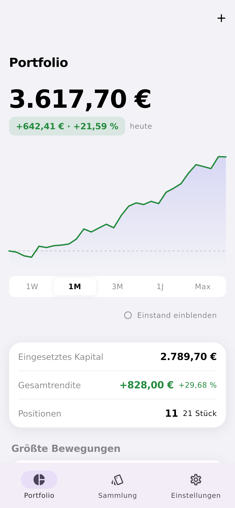
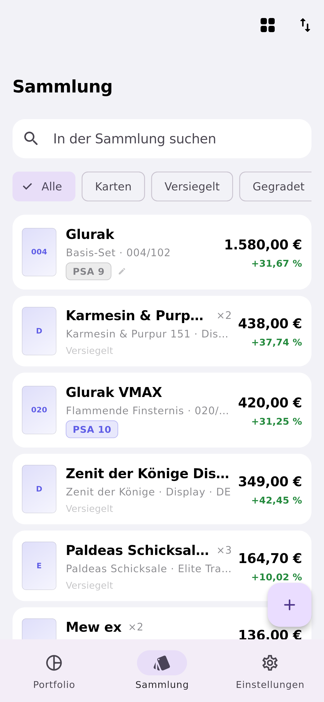
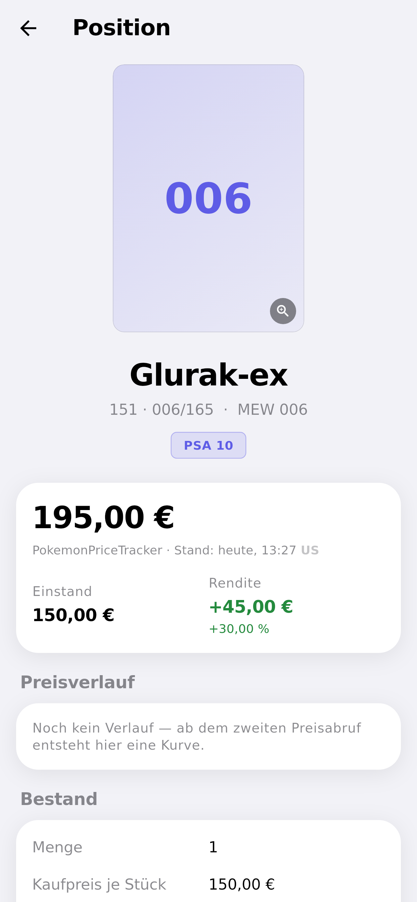
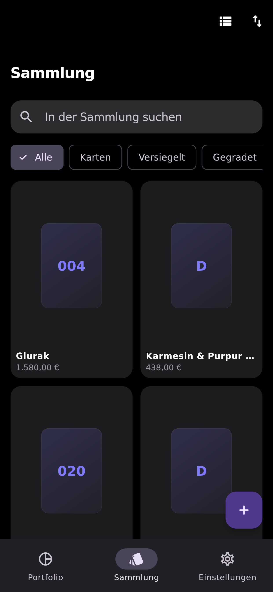
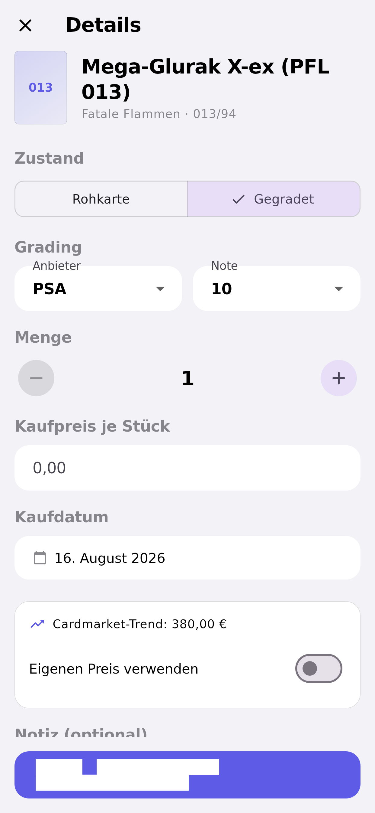
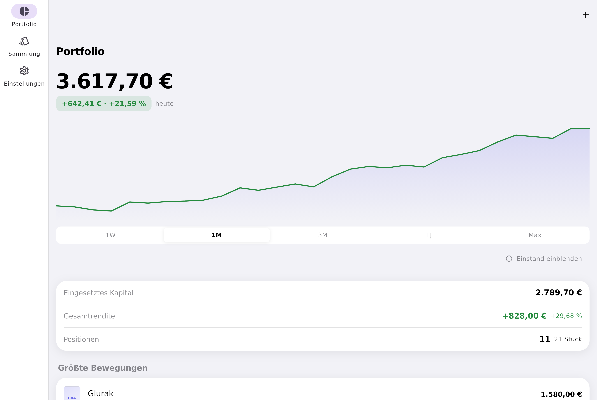

# MyCollector

Verwaltung einer Pokémon-Sammlung — Einzelkarten und versiegelte Produkte — mit Wertentwicklung im Stil einer Börsen-App. Für Sammler im deutschsprachigen Raum.

📄 **[Konzept- & Architekturdokument (PLANUNG.md)](PLANUNG.md)** — Feature-Priorisierung, API-Vergleich mit Begründung, Tech-Stack, Datenmodell, UI/UX-Konzept, rechtliche Risiken und Roadmap.

---

## Was die App kann

| | |
|---|---|
| **Portfolio** | Gesamtwert, Tagesveränderung und Gesamtrendite; interaktiver Wertverlauf mit Zeiträumen 1W/1M/3M/1J/Max, Scrubbing per Fingerdruck und optionaler Einstandslinie; größte Gewinner und Verlierer; Aufteilung nach Kategorie und Set |
| **Sammlung** | Alle Positionen als Liste oder Raster, Suche, Filter (Karten, Versiegelt, Gegradet), Sortierung nach Wert, Rendite, Name oder Kaufdatum, Wischgeste zum Löschen |
| **Erfassen** | Kartensuche mit deutschen Namen, Umschalter Rohkarte ↔ Gegradet (PSA, BGS, CGC, SGC, ACE, TAG mit Note), Variante und Erhaltung, Menge, Kaufpreis, Kaufdatum, Notiz; versiegelte Produkte frei anlegbar |
| **Preise** | Cardmarket-Preise in Euro über TCGdex, manueller Preis-Override als gleichwertige Option, jeder Wert mit Quelle und Stand, US-Werte gekennzeichnet |
| **Darstellung** | Hell, Dunkel oder Systemvorgabe |
| **Daten** | Alles liegt lokal in SQLite; vollständiger JSON-Export als Sicherung |

## Bildschirmfotos

| Portfolio | Sammlung | Produktdetail |
|---|---|---|
|  |  |  |

| Dunkel | Position hinzufügen | Desktop |
|---|---|---|
|  |  |  |

Die Bilder entstehen automatisch aus den Tests (siehe unten) und zeigen daher immer den tatsächlichen Stand der App.

## Entwicklung

Voraussetzung: Flutter 3.47 oder neuer.

```bash
flutter pub get
dart run build_runner build     # erzeugt den Datenbankcode (Drift)
flutter run                     # -d ios | android | macos | windows
```

Beim ersten Start ist die Sammlung leer. Unter **Einstellungen → Beispieldaten laden** lässt sich ein Beispielbestand mit Wertverlauf einspielen, um die App ohne eigene Karten auszuprobieren.

### Tests

```bash
flutter analyze
flutter test                                          # 93 Tests
flutter test --update-goldens test/screenshots        # Bildschirmfotos neu erzeugen
```

Die Tests decken die Bewertungs-Kaskade, die Portfolio-Mathematik, die Datenbank (gegen eine echte SQLite-Instanz), die deutsche Formatierung, die Bedienabläufe und die Darstellung ab.

## Aufbau

```
lib/
  domain/         Reines Dart ohne Framework-Bezug: Modelle, Preis-Kaskade,
                  Portfolio-Mathematik, Snapshots, Chart-Zeitreihen
  data/
    local/        SQLite über Drift, Repository-Implementierung
    remote/       Katalog-/Preisquellen hinter einem gemeinsamen Interface
    demo/         Beispieldaten für den Betrieb ohne Netz
  app/            Zustandsverwaltung (Riverpod), App-Rahmen
  features/       Screens: portfolio, collection, settings
  ui/             Designsystem, Formatierung, gemeinsame Bausteine
```

Die Domänenschicht kennt weder Flutter noch SQLite noch eine API. Das hält die Kernlogik testbar und macht den Wechsel einer Datenquelle zu einem lokalen Eingriff — was angesichts der Marktlage bei TCG-APIs (siehe [PLANUNG.md §3](PLANUNG.md)) keine Vorsichtsmaßnahme auf Vorrat ist, sondern eine absehbare Notwendigkeit.

## Hinweise

Inoffizielles Fanprojekt. Pokémon sowie alle zugehörigen Namen und Abbildungen sind Marken von Nintendo, Creatures Inc. und GAME FREAK inc.; es besteht keine Verbindung zu The Pokémon Company.

Angezeigte Preise sind Referenzwerte aus öffentlichen Quellen — keine Kaufangebote und keine Anlageberatung.
